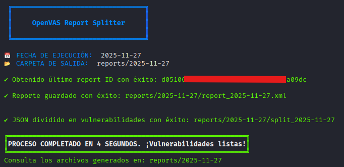

# OpenVAS-Report-Splitter

**OpenVAS Report Splitter** es una herramienta de automatización para el procesado de informes de auditoría generados por **OpenVAS**. Esta herramienta extrae automáticamente el último reporte de una tarea en formato XML en crudo, y lo transforma en un reporte en formato JSON limpio y estructurado. Una vez hecho eso, divide cada vulnerabilidad presente en el reporte en su propio archivo JSON para simplificar su análisis, integración en pipelines o ingesta en plataformas SIEM, entre otros.

## Salida esperada de la herramienta 📸

Una vez finaliza la tarea de la herramienta, se generará una estructura de carpetas con el siguiente formato:
- `report_AAAA-MM-DD.xml`: Informe bruto descargado directamente de GVM.
- `report_AAAA-MM-DD.json`: JSON consolidado y estructurado.
- `split_AAAA-MM-DD/`: Directorio con un archivo JSON independiente por cada vulnerabilidad detectada.



---

## Despliegue y uso de la herramienta 🚀

ATENCIÓN: Antes del despliegue, se debe de disponer de **Docker** (v20.10+) y **Docker Compose** (v1.29+) y una instancia de **OpenVAS/GVM**.

#### 1. Clona el repositorio y entra al directorio

```bash
git clone https://github.com/danielbarbeytotorres/OpenVAS-Report-Splitter.git
cd OpenVAS-Report-Splitter
```

#### 2. Crea y configura el entorno 

```bash
cp env.example .env
```

Debes abrir el nuevo archivo **.env** con un editor de texto (como el **Bloc de Notas** o **VS Code**) y rellena sus datos reales de OpenVAS:
- **TASK_ID**: El UUID de la tarea de escaneo que quiere extraer.
- **GMP_USER**: Su usuario de OpenVAS/GVM.
- **GMP_PASSWORD**: Su contraseña de acceso.

### 3. Construir y levantar el orquestador

```bash
docker-compose up --build
```

Como curiosidad, al ejecutar ese comando Docker leerá el Dockerfile, compilará la imagen de Python con gvm-tools, inyectará las variables del .env y correrá el pipeline.sh. El script descargará el reporte de OpenVAS, luego lo procesará a JSON y por último troceará las vulnerabilidades en el volumen persistente reports_data.

## 4. Extracción de resultados

Como el contenedor se apaga tras completar la tarea, el último paso que debe cumplir el usuario que use este código es copiar la carpeta de resultados desde el volumen Docker a su directorio local con el siguiente comando:

```bash
docker cp openvaspython-splitter:/app/reports ./reportes
```

Dentro de la carpeta **./reportes** tendrá tanto el informe XML bruto, como el JSON consolidado, como el directorio con cada vulnerabilidad individual dividida en formato JSON.

Herramienta desarrollada por **Daniel Barbeyto Torres**.